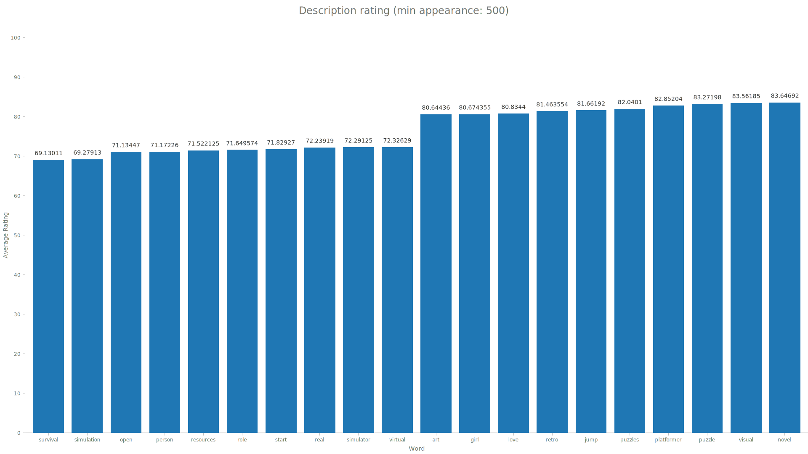
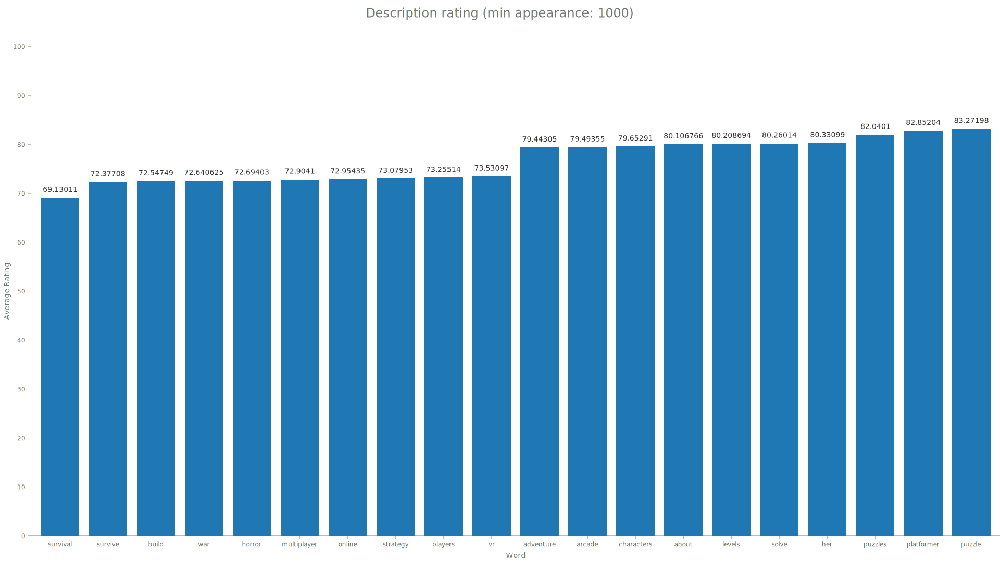
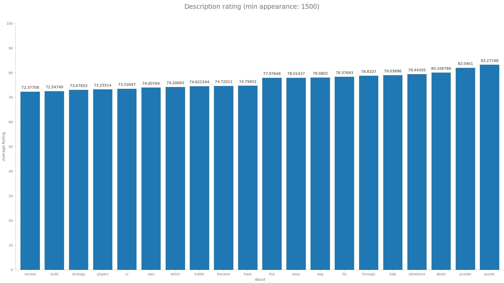
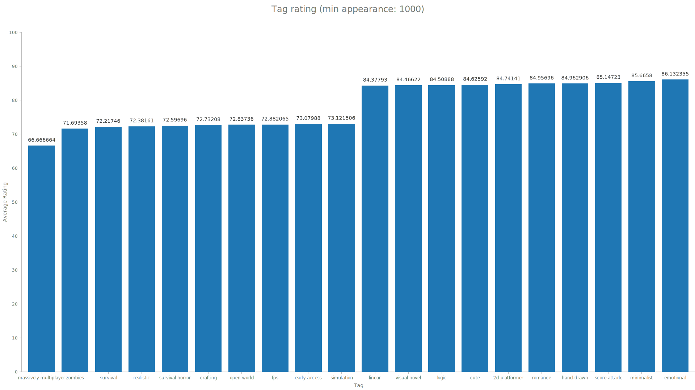
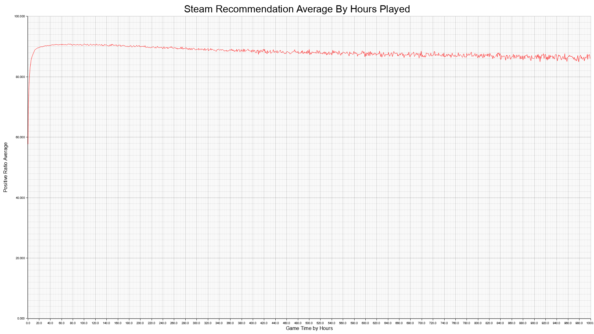

# steamRecommendation
The data cames from a kaggle [database](https://www.kaggle.com/datasets/antonkozyriev/game-recommendations-on-steam/data?select=games.csv). When doing some research I found some intresting ratios you can compare in this vast dataset. The following categories are some intresting ratios shown in charts and a graph made in rust.

# Description Ratio
In the following svgs I disected the descriptions of over 50,000 steam games given in the dataset into individual words. I then took the words and found the average positive-ratio for each game to see what words could possible drive up like rate. The svgs are each with a diffrent min appeareances in games filer and how it affects the words and shows the top and bottom 5 ratios.

# Tag Ratio
These ratios are the same as the previous but using the already built in tags fields attached to games metadata.

# hours played x recomendation hours Ratio
This final ratio I looked into was how the amount of hours played affects the recommend ratio. The following png shows the averages for each hour put on a graph by parsing over 30 million reviews 100 times with binary searches.

#conclusion
Feel free to take my code and add your own twist. I made the functions easily adjustable so you can run some of your own hypothesis on the database as well. However the last update to this database at the time of writing this was a year ago.
